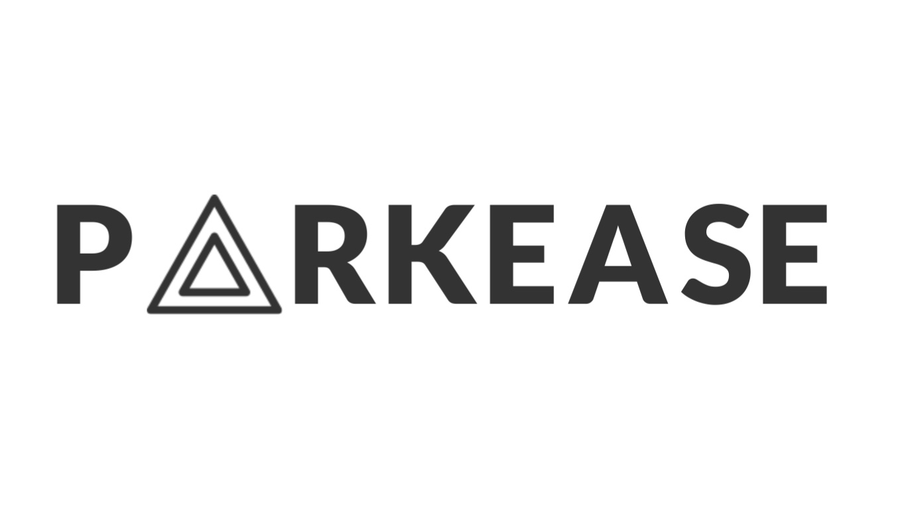

 

  

  

    "Park with ease, pay with breeze - your hassle-free parking solution is here with PARKEASE!"
     
     
    <a href="PARKEASE DOCUMENTATION/PARKEASE DOCUMENTATION.pdf"><strong>Explore the docs »</strong></a>
     
     
    <a href="https://parkease.vercel.app">Website</a>
    .
    <a href="https://drive.google.com/file/d/1k35T2plLICuuwJIJoQ_r9BUdfotTNSuZ/view?usp=drive_link">View Demo</a>
    .
    <a href="https://github.com/Shivanaik11/PARKEASE/issues">Report a Bug</a>
  

   

## Table Of Contents
* [About the Project](#about-the-project)
* [Methodology](#Methodology)
* [Getting Started](#guide-for-running-the-code)
* [License](#license)

## About The Project
Introducing PARKEASE, the revolutionary concept designed to streamline parking with zero human intervention. Say goodbye to the hassle of searching for parking spots and dealing with attendants. PARKEASE leverages cutting-edge technology to automate the entire parking process, ensuring a seamless experience for users.

## Methodology

1. **User Registration:**
   - Users visit [parkease.vercel.app](https://parkease.vercel.app) to register by providing their vehicle number, name, and basic details.
   - Upon registration, a digital wallet is created for the user, allowing them to add money using preferred payment methods.

2. **Entry Process:**
   - When a vehicle enters the parking lot, sensors detect its presence and trigger the camera.
   - The camera captures the vehicle number plate, which is processed using Optical Character Recognition (OCR) or Tesseract.
   - The extracted number along with the timestamp is sent to the database (Firebase), and a parking slot is assigned.
   - For registered users, the system checks their wallet balance. A minimum balance is required for parking.

3. **Parking Duration:**
   - The system records the entry time and calculates the duration of parking based on the entry and exit times.

4. **Exit Process:**
   - When the vehicle exits, the exit time is recorded.
   - For registered users, the system automatically deducts the parking fee from their wallet if they have a sufficient balance.
   - Guest users receive a dynamic QR code containing the bill amount, which they pay upon exit.

5. **Billing:**
   - The billing system calculates the parking fee based on the time parked, with a standard rate per hour.

## Guide for Running the Code 🚀

### Ready to get PARKEASE up and running? Follow these steps to set everything up smoothly:

### 1. Clone or Fork the Repository 🍴⬇️

### 2. Navigate to the Specific Folders and Follow the Instructions Below:

**In the <a href="PYTHON"><strong>PYTHON</strong></a> Folder:**
1. **Install Required Libraries:** Make sure all necessary libraries are installed.
2. **Configure Tesseract OCR:**
   - Update the location to Tesser OCR installed on your computer.
   - Download it from [Tesseract OCR Downloads](https://tesseract-ocr.github.io/tessdoc/Downloads.html).
3. **Firebase Setup:**
   - Replace with your Firebase credentials. Create a Firebase account, set up a project, and obtain your keys.
4. **UPI ID:**
   - On line 308, add your UPI ID.

**In the <a href="WEBSITE"><strong>WEBSITE</strong></a> Folder:**
1. **Firebase Configuration:**
   - In `index.js` and `dashboard.js`, update your Firebase credentials.
2. **Update Firebase Rules:**
   - In the Firebase console, navigate to the `Realtime Database` section and click on `Rules`.
   - Replace the existing rules with the content from the `FIREBASE RULES` file.
3. **Payment Gateway URL:**
   - In `dashboard.js` on line 47, replace with your payment gateway URL. Use your preferred gateway; Razorpay is used here as an example.

**In the <a href="HARDWARE"><strong>HARDWARE</strong></a> Folder:**
1. **Install Required Libraries:** Ensure all necessary libraries and ESP32 board package are downloaded.
2. **Configure WiFi and Firebase:**
   - In `ENTRY1` and `EXIT1`, replace with your WiFi SSID, password, Firebase credentials, and an email with your preferred password.
3. **Upload Code to ESP32:**
   - Open the Arduino IDE.
   - Select the appropriate ESP32 board and COM port from the Tools menu.
   - Upload the `ENTRY1` code to one ESP32 microcontroller and the `EXIT1` code to the other.
   - Refer to the circuit diagram provided in the `CIRCUIT DIAGRAM` folder and rigup the circuit.

### ⚙️ You're all set! Enjoy seamless parking with PARKEASE! 🙌

## License
Distributed under the Mozilla Public License Version 2.0 See [LICENSE](https://github.com/Shivanaik11/PARKEASE/blob/main/LICENSE.md) for more information.

